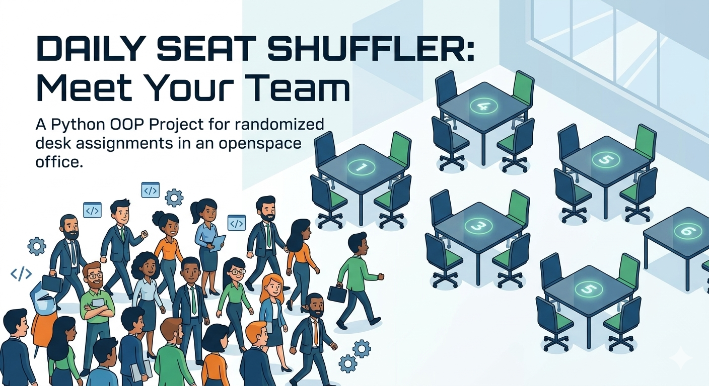

# OpenSpace Organizer

## Project Overview

Your company moved to a new office at CEVI Ghent. Its an openspace with 6 tables of 4 seats. As many of you are new colleagues, you come up with the idea of changing seats everyday and get to know each other better by working side by side with your new colleagues. 
This script runs everyday to re-assign everybody to a new seat.

---

## Key actions
* Designed a modular architecture using Object-Oriented Programming (OOP) by defining Seat, Table, and Openspace classes.
* Developed and validated the core randomization logic within a Jupyter Notebook environment.
* Refactored the initial code into a production-ready script, splitting functionality across specialized Python files (table.py, openspace.py, main.py).
* Implemented automated data ingestion from external files and configured a centralized execution entry point.

--- 

## Repo structure

```
.
├── utils/
│   ├── __init__.py
│   ├── file_utils.py
│   ├── openspace.py
│   └── table.py
├── .gitignore
├── main.py
├── new_colleagues.csv
├── README.md
└── Output.csv
```
---
## Installation

1. **Clone the project:**

```
cmd git clone https://github.com/butkutez/challenge-openspace-classifier.git
```
2. **Navigate into the project folder**

```
cd Challenge-openspace-classifier
```

3. **Run the script**

```
python main.py
```
---
## Usage

The script reads your input file (new_colleagues.csv), and organizes your colleagues to random seat assignments. The resulting seating plan is displayed in your console and also saved to an "Output.csv" file in your root directory. 

```python

from utils.openspace import Openspace
from utils.file_utils import load_new_colleagues

def main():

    # Load the list of colleagues from the CSV file
    names = load_new_colleagues()

    # Create an Openspace instance
    openspace_classifier = Openspace()

    # Randomly assign colleagues to tables
    openspace_classifier.organize(names)

    # Display the table arrangement
    openspace_classifier.display()

    # Save the table arrangement to an output CSV file
    openspace_classifier.store("Output.csv")

if __name__ == "__main__":
    main()

```
---

## Timeline
This project took 2 days for completion.
---

## 📌 Personal context note
This project was done as part of the AI & Data Science Bootcamp at BeCode (Ghent), class of 2025-2026. 
Feel free to reach out or connect with me on [LinkedIn](https://www.linkedin.com/in/shashkov-aleksei/)!